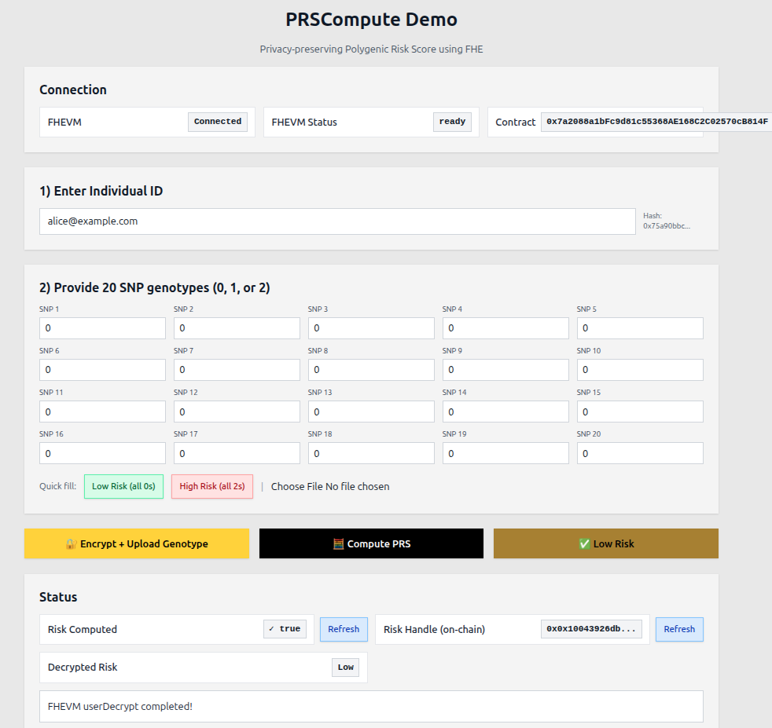

# Privacy-Preserving Genome Analysis (Phase 1)

A decentralized application for privacy-preserving genome analysis using Fully Homomorphic Encryption (FHE). This application enables secure computation on encrypted genomic data without revealing the underlying genetic information, built on the FHEVM (Fully Homomorphic Encryption Virtual Machine).



## 🧬 What is Privacy-Preserving Genome Analysis?

This project demonstrates the first phase of a privacy-preserving genome analysis platform where:
- **Genomic data remains encrypted during computation** - Analysis happens on encrypted DNA sequences
- **Zero-knowledge results** - Obtain insights without exposing raw genetic information
- **Blockchain transparency** - Immutable audit trail of all genome analysis operations
- **User sovereignty** - Complete control over sensitive genetic data
- **Decentralized privacy** - No trusted third party has access to unencrypted genomic data

### Phase 1: Foundation
The current implementation focuses on establishing the core infrastructure for encrypted genome data processing, demonstrating fundamental FHE operations on genomic sequences while maintaining complete privacy.

## 🚀 What is FHEVM?

FHEVM (Fully Homomorphic Encryption Virtual Machine) enables computation on encrypted data directly on Ethereum. This application leverages FHEVM to perform genome analysis while keeping sensitive genetic data private and secure throughout the entire computation pipeline.

## ✨ Features

- **🔐 FHEVM Integration**: Built-in support for fully homomorphic encryption of genomic data
- **🧬 Privacy-First Design**: All genetic information remains encrypted on-chain
- **⚛️ React + Next.js**: Modern, performant frontend framework for genome analysis interface
- **🎨 Tailwind CSS**: Utility-first styling for rapid UI development
- **🔗 RainbowKit**: Seamless wallet connection and management
- **🌐 Multi-Network Support**: Works on both Sepolia testnet and local Hardhat node
- **📦 Monorepo Structure**: Organized packages for SDK, contracts, and frontend
- **🔬 Genome Analysis Tools**: Initial set of privacy-preserving genetic computation primitives

## 🧰 Scripts overview

| Script | What it does |
| ------ | ------------- |
| `pnpm start` | Starts the Next.js dev server (frontend) |
| `pnpm chain` | Starts the local Hardhat node (RPC http://127.0.0.1:8545) |
| `pnpm deploy:localhost` | Deploys contracts to localhost and generates TypeScript ABIs |
| `pnpm deploy:sepolia` | Deploys contracts to Sepolia and generates TypeScript ABIs |
| `pnpm next:build` | Builds the frontend for production |
| `pnpm test` | Runs Hardhat tests |
| `pnpm lint` | Lints Next.js and Hardhat packages |
| `pnpm format` | Formats code in Next.js and Hardhat packages |
| `pnpm update-submodule` | Updates the Hardhat submodule and restores custom contracts |
| `pnpm sdk:build` | Builds the local FHEVM SDK package |

## 📋 Prerequisites

Before you begin, ensure you have:

- **Node.js** (v18 or higher)
- **pnpm** package manager
- **MetaMask** browser extension
- **Git** for cloning the repository

## 🛠️ Quick Start

### 1. Clone and Setup

```bash
# Clone the repository
git clone <repository-url>
cd fhevm-react-template

# Initialize submodules (includes fhevm-hardhat-template)
git submodule update --init --recursive

# Install dependencies
pnpm install
```

### 2. Environment Configuration

Set up your Hardhat environment variables by following the [FHEVM documentation](https://docs.zama.ai/protocol/solidity-guides/getting-started/setup#set-up-the-hardhat-configuration-variables-optional):

- `MNEMONIC`: Your wallet mnemonic phrase
- `INFURA_API_KEY`: Your Infura API key for Sepolia

### 3. Start Development Environment

**Option A: Local Development (Recommended for testing)**

```bash
# Terminal 1: Start local Hardhat node
pnpm chain
# RPC URL: http://127.0.0.1:8545 | Chain ID: 31337

# Terminal 2: Deploy contracts to localhost
pnpm deploy:localhost

# Terminal 3: Start the frontend
pnpm start
```

**Option B: Sepolia Testnet**

```bash
# Deploy to Sepolia testnet
pnpm deploy:sepolia

# Start the frontend
pnpm start
```

### 4. Connect MetaMask

1. Open [http://localhost:3000](http://localhost:3000) in your browser
2. Click "Connect Wallet" and select MetaMask
3. If using localhost, add the Hardhat network to MetaMask:
   - **Network Name**: Hardhat Local
   - **RPC URL**: `http://127.0.0.1:8545`
   - **Chain ID**: `31337`
   - **Currency Symbol**: `ETH`

### ⚠️ Common pitfalls

- If contracts are not found, make sure submodules are initialized with
  `git submodule update --init --recursive` and that you have run `pnpm install`.

## 🎮 Demo Flow

This demo showcases a privacy-preserving Polygenic Risk Score (PRS) computation using Fully Homomorphic Encryption (FHE).

### How It Works

1. Connect your wallet
   - Click "Connect Wallet" to link MetaMask
   - Your address is used as your identity

2. Enter Individual ID
   - Provide an identifier (e.g., email); it's hashed on-chain

3. Provide 20 SNP genotypes (0, 1, or 2)
   - Type values manually, use the quick-fill buttons, or upload a CSV/JSON file

4. Encrypt + Upload Genotype
   - The app encrypts your SNPs client-side and submits external ciphertexts
   - The contract stores encrypted SNPs (euint32); plaintext never leaves your device

5. Compute PRS on-chain
   - The contract computes an encrypted weighted sum using built-in effect sizes and a risk threshold
   - It stores:
     - Encrypted PRS score (euint32)
     - Encrypted classification (ebool: high/low risk)

6. Decrypt risk classification
   - Request decryption for the classification only
   - You learn whether the PRS crosses the threshold; the numeric PRS remains encrypted

7. Optional: Refresh status
   - Check whether risk has been computed and view the on-chain risk handle

### Why PRS with FHE?

- Encrypted inputs: your genotype remains private
- Secure computation: on-chain PRS computed over ciphertexts
- Privacy-preserving results: only the classification is revealed
- Extensible: the same primitives generalize to richer genomic analyses

## 🔄 Managing Custom Contracts in Submodule

Since `packages/hardhat` is a git submodule pointing to the upstream [fhevm-hardhat-template](https://github.com/zama-ai/fhevm-hardhat-template), custom contracts need special handling to avoid being overwritten during submodule updates.

### Updating the Submodule

When you need to update the hardhat submodule to get the latest changes from upstream:

```bash
pnpm update-submodule
```

This script automatically:
1. Backs up custom contracts (like [PRSCompute.sol](packages/hardhat/contracts/PRSCompute.sol)) from the submodule to [custom-contracts/](custom-contracts/)
2. Updates the submodule to the latest version
3. Restores custom contracts back to the submodule
4. Updates the deployment script to include custom contracts

### Adding New Custom Contracts

If you want to add a new custom contract:

1. Place your contract file in [custom-contracts/](custom-contracts/)
2. Add the contract name to the `CUSTOM_CONTRACTS` array in [scripts/updateSubmodule.ts](scripts/updateSubmodule.ts)
3. Run `pnpm update-submodule` to apply the changes

See [custom-contracts/README.md](custom-contracts/README.md) for more details.

## 📁 Project Structure

This application uses a monorepo structure with three main packages:

```
fhevm-hardhat-template/
├── packages/
│   ├── hardhat/                  # Smart contracts for genome analysis
│   ├── fhevm-sdk/                 # FHEVM SDK package
│   └── nextjs/                    # React frontend for genome interface
├── scripts/                       # Build and deployment scripts
└── custom-contracts/              # Custom genome analysis contracts
```

## 📄 License

This project is licensed under the **BSD-3-Clause-Clear License**. See the [LICENSE](LICENSE) file for details.
